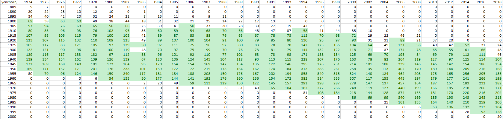

The General Social Survey is not a panel survey. However, it is both a very long-running with a large and diverse set of participants, and while the survey contains nearly no personally identifying information some basic demographic information is included in the data. Because both “age of respondent” and “year of survey” are provided, some basic manipulation of the data gets it to a place where we can use <b>birth year</b> as a unit of analysis.

```{r, include = FALSE, message=FALSE}
library(ggplot2)
library(plotly)
require(tidyverse)
require(dplyr)
library(foreign)
library(haven)
library(plyr)
library(heatmaply)
library(reticulate)

knitr::knit_engines$set(python = reticulate::eng_python)
```

```{r, include = FALSE, message=FALSE}
#gss <- read_csv('C:\\Users\\Zach Gozlan\\DataScience\\Data Viz Project\\full_gss.csv') #this is a version of the full gss data set that was converted to csv
```

```{r, include = FALSE, message=FALSE}
#variables that were needed from this project were pulled out, exported, and sent to python for easy manipulation
#myvars2 <- c("year", "age", "sex", "polviews", "happy", "conrinc", "wtssall", "natrace", "life", "trust", "dwelown", "marital") #for final project
#gss_finalproj <- gss[myvars2]
#write.csv(gss_finalproj, 'C:\\Users\\Zach Gozlan\\DataScience\\Data Viz Project\\fp_gss_1.csv')
```

For the sake of sample size, 




```{python}
import pandas as pd
gss_frame_1 = pd.read_csv('fp_gss_1.csv')
gss_frame_1['year_of_birth'] = gss_frame_1.year - gss_frame_1.age
gss_frame_1['yearborn_binned5'] = (gss_frame_1.year_of_birth // 5) * 5 #rounds year born to nearest 5-year interval
print(pd.crosstab(gss_frame_1.yearborn_binned5, gss_frame_1.year))
```


```{r, include = FALSE, message=FALSE}
gss_means = read_csv('birthcohort_means.csv') #the recoded data set, imported back in for presentation
gss_means = gss_means[!gss_means$survey_yr == 1983,] #realized i should drop this year - sparse data
```

```{r, , echo=FALSE, message=FALSE}
polviews_survey_yr <- ggplot(data=gss_means[gss_means$survey_yr > 1984,], aes(x=age, y=polviews_wmean, colour=as.factor(birth_cohort))) +
  geom_line() + labs(title="Do we get more conservative as we get older?", caption="Political views of birth cohorts in the GSS \n at available range of ages")

#ggsave('polviews_survey_yr_test1.png', plot = polviews_survey_yr, width = 20, height = 6)

ggplotly(polviews_survey_yr)  %>%
  layout(title = list(text = paste0('Do we get more conservative as we get older?',
                                    '<br>',
                                    '<sup>',
                                    'Political views of birth cohorts in the GSS at available range of ages',
                                    '</sup>')))
```

```{r, , echo=FALSE, message=FALSE, warning=FALSE}
polviews_age <- ggplot(data=gss_means, aes(x=as.factor(survey_yr), y=birth_cohort, fill=polviews_wmean, text = paste("Sample Size:", counts, "\n Age:", age))) +
  geom_tile() + scale_fill_gradient(low="orange", high="blue4") + theme(axis.text.x = element_text(angle=45))

#ggsave('polviews_age_test1.png', plot = polviews_age, width = 10, height = 6)

ggplotly(polviews_age, tooltip=c("x", "y", "fill", "text"))
```


```{r, , echo=FALSE, message=FALSE}
polviews_married <- ggplot(data=gss_means, aes(x=as.factor(survey_yr), y=birth_cohort, fill=as.factor(been_married_wmean_binned), text = paste("Sample Size:", counts, "\n Age:", age, "\n Marriage%:", been_married_wmean))) + scale_fill_brewer(palette="Spectral") +
  geom_tile() + theme(axis.text.x = element_text(angle=45))

#ggsave('polviews_age_test1.png', plot = polviews_age, width = 10, height = 6)

ggplotly(polviews_married, tooltip=c("x", "y", "text"))
```

```{r, echo=FALSE, message=FALSE}
polviews_married <- ggplot(data=gss_means[gss_means$survey_yr > 1988,], aes(x=as.factor(survey_yr), y=birth_cohort, fill=as.factor(dwelown_wmean_binned), text = paste("Sample Size:", counts, "\n Age:", age, "\n Marriage%:", been_married_wmean))) + scale_fill_brewer(palette="Spectral") +
  geom_tile() + theme(axis.text.x = element_text(angle=45))

#ggsave('polviews_age_test1.png', plot = polviews_age, width = 10, height = 6)

ggplotly(polviews_married, tooltip=c("x", "y", "text"))
```

```{r, echo=FALSE, message=FALSE, warning=FALSE}
polviews_age <- ggplot(data=gss_means, aes(x=survey_yr, y=relative_youth, fill=polviews_wmean, text = paste("Sample Size:", counts, "\n Age:", age))) +
  geom_tile() + scale_fill_gradient(low="orange", high="blue4") + theme(axis.text.x = element_text(angle=45))

#ggsave('polviews_age_test1.png', plot = polviews_age, width = 10, height = 6)

ggplotly(polviews_age, tooltip=c("x", "y", "fill", "text"))
```

```{r, echo=FALSE, message=FALSE}
ggplot(data=gss_means, aes(x=age, y=conrinc_median, colour=as.factor(is2018))) +
  geom_point()
```

<p style="font-family: times, serif; font-size:11pt; font-style:italic">
    test of html formatting
</p>

```{r, echo=FALSE, message=FALSE}
test_gen <- subset(gss_means, relative_youth==1)
ggplot(data=test_gen, aes(x=survey_yr, y=polviews_wmean)) + geom_line()
```
